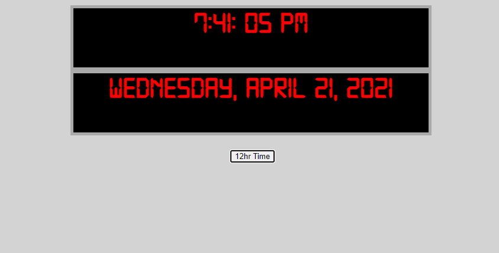

# Vanilla JavaScript Digital Clock

*A simple digital clock app written in pure JavaScript, HTML, and CSS*

See it [here](https://kendric84.github.io/DigitalClock/)

## Summary
This simple digital clock will allow you to switch between 12 hour time and military time.

## Author
- **Graham Smith** - Full-Stack Software Developer - [GrahamS.tech](https://www.grahams.tech)